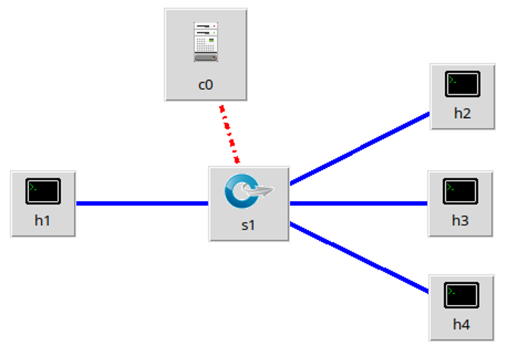
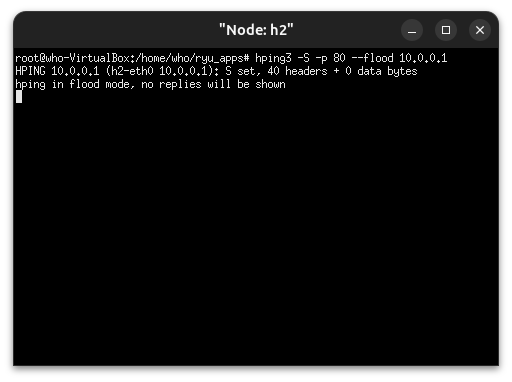
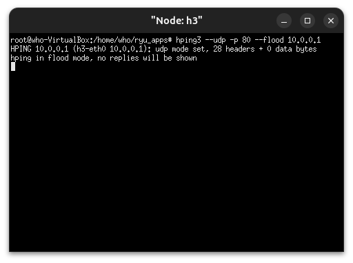
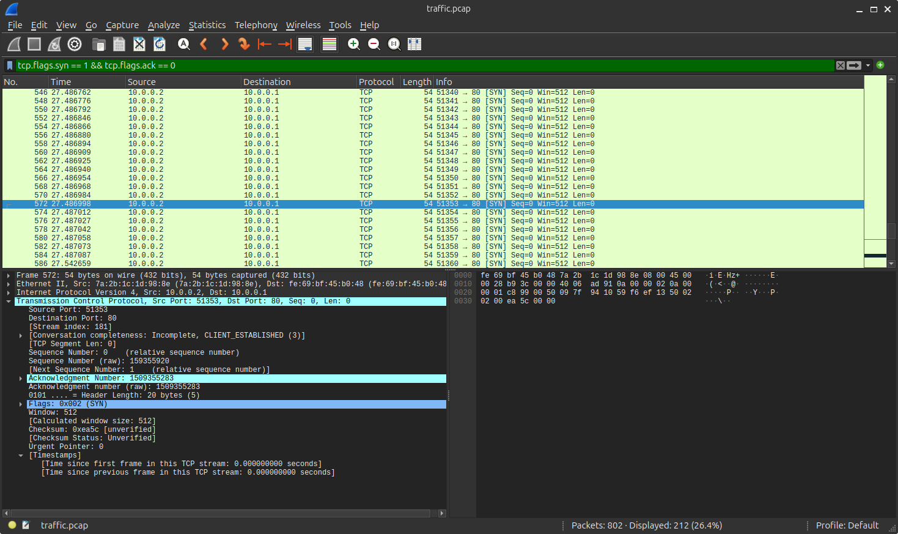
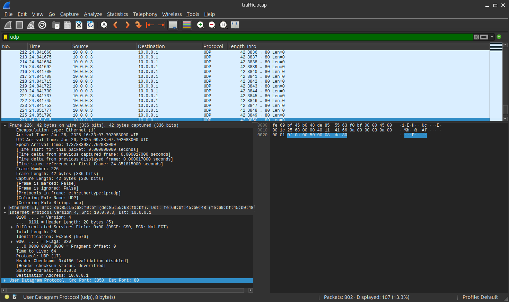
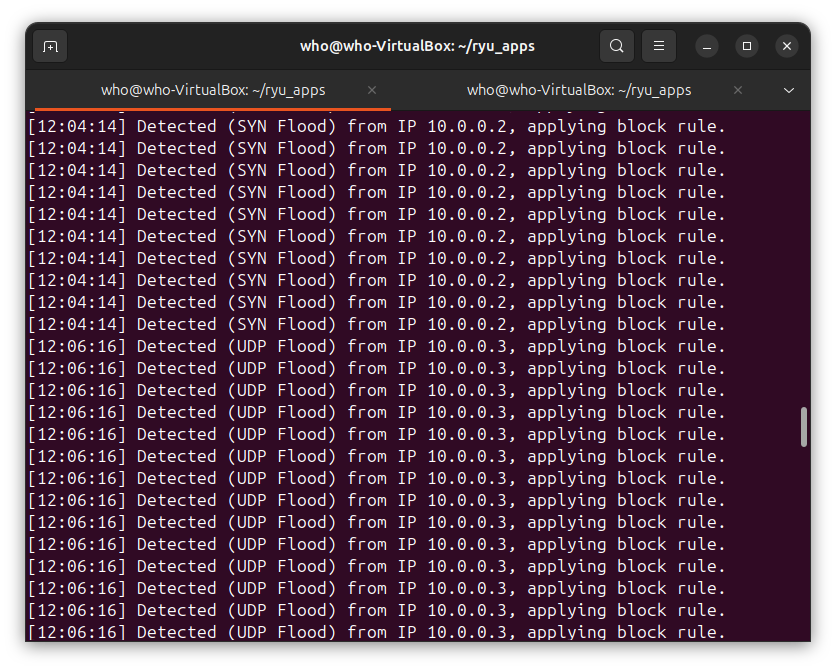
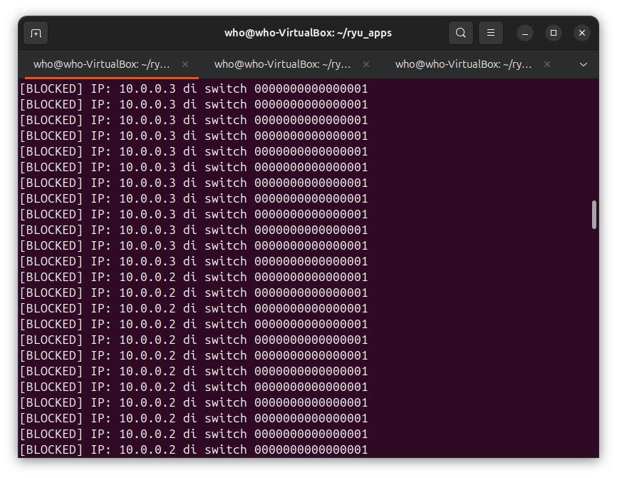
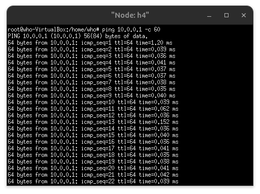
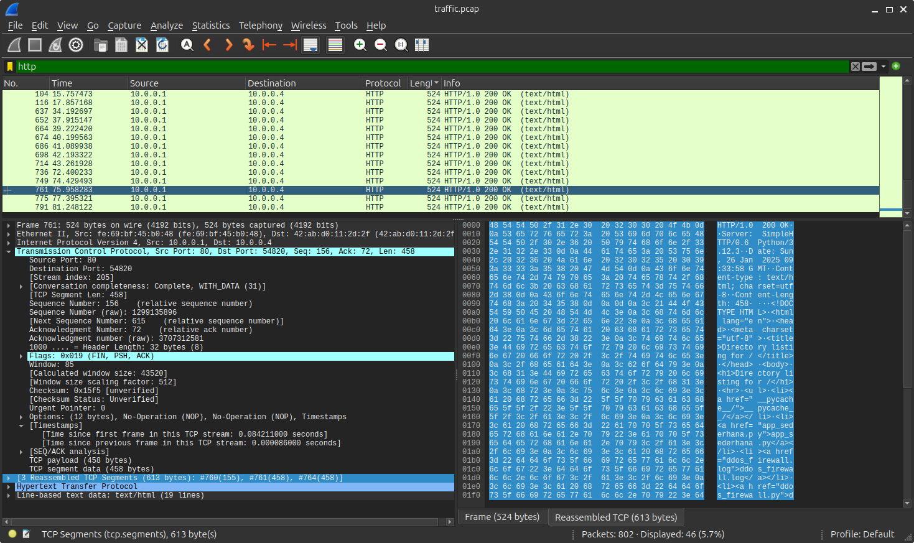
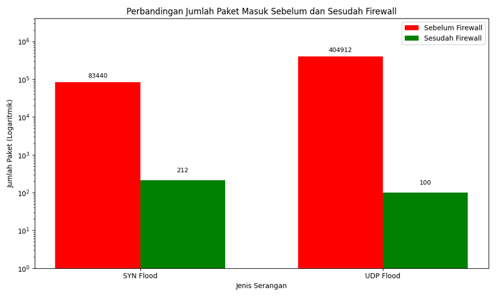

# Dynamic Firewall for DDoS Detection & Mitigation

<p align="center">
  <b>SDN-based dynamic firewall for detecting and mitigating abnormal network traffic</b><br>
  Ryu Controller · OpenFlow 1.3 · Mininet · Python
</p>

<p align="center">
  
</p>

---

## Overview

This project implements an **adaptive firewall as a Ryu SDN application using OpenFlow 1.3**.

The firewall maintains packet statistics per source IP, applies configurable traffic thresholds, updates thresholds from observed traffic, detects abnormal traffic patterns, and installs an OpenFlow rule to block suspicious source IP addresses.

The experiment focuses on **DDoS traffic detection and mitigation**, with evidence collected through Mininet, hping3, Wireshark, tcpdump/PCAP analysis, and Ryu controller logs.

### Research Focus

- DDoS detection
- SYN Flood
- UDP Flood
- Dynamic thresholding
- Source-IP based blocking
- Software-Defined Networking (SDN)
- OpenFlow 1.3
- Network traffic analysis

---

## Key Results

| Attack | Before | After | Packet-count reduction |
|---|---:|---:|---:|
| **SYN Flood** | 83,440 | 212 | **99.75%** |
| **UDP Flood** | 404,912 | 100 | **99.98%** |

> The percentages above represent **packet-count reduction between the supplied before/after measurements**. They are not presented as a direct percentage of packets blocked unless that definition is explicitly established by the experiment methodology.

### Normal Traffic Impact

The supplied latency result shows:

```text
Before Firewall : 1.0 ms
After Firewall  : 2.5 ms
Change          : +1.5 ms
```

A numerical **detection time** is intentionally not claimed because the available evidence does not contain synchronized timestamps for both attack start and first Ryu detection.

---

## Architecture

```text
                         ┌──────────────────────┐
                         │    Ryu Controller     │
                         │   Dynamic Firewall    │
                         │     OpenFlow 1.3      │
                         └──────────┬───────────┘
                                    │
                                    │ OpenFlow
                                    ▼
                              ┌───────────┐
                              │    s1     │
                              │   OVS     │
                              └─────┬─────┘
                    ┌───────────────┼───────────────┐
                    │               │               │
                    ▼               ▼               ▼
               ┌────────┐      ┌────────┐      ┌────────┐
               │   h1   │      │   h2   │      │   h3   │
               │ Server │      │  SYN   │      │  UDP   │
               │10.0.0.1│      │ Flood  │      │ Flood  │
               └────────┘      │10.0.0.2│      │10.0.0.3│
                               └────────┘      └────────┘

                              ┌────────┐
                              │   h4   │
                              │ Normal │
                              │Traffic │
                              │10.0.0.4│
                              └────────┘
```

### Node Roles

| Node | Role | IP |
|---|---|---|
| `h1` | Server / target | `10.0.0.1` |
| `h2` | SYN Flood attacker | `10.0.0.2` |
| `h3` | UDP Flood attacker | `10.0.0.3` |
| `h4` | Normal traffic | `10.0.0.4` |
| `s1` | OpenFlow 1.3 switch | — |
| `c0` | Ryu controller | `127.0.0.1:6633` |

---

## Detection & Mitigation Flow

```text
Traffic
   │
   ▼
Packet statistics per source IP
   │
   ▼
Dynamic threshold evaluation
   │
   ├── Normal ───────► Forward normally
   │
   └── Threshold exceeded
                    │
                    ▼
              Attack detected
                    │
                    ▼
             Block source IP
                    │
                    ▼
             OpenFlow rule
                    │
                    ▼
             Traffic mitigated
```

The supplied firewall implementation maintains per-source packet counters and uses threshold-based decisions before applying an OpenFlow blocking rule.

---

## Technology Stack

| Category | Technology |
|---|---|
| Programming | Python |
| SDN Controller | Ryu |
| Protocol | OpenFlow 1.3 |
| Network Emulator | Mininet |
| Virtual Switch | Open vSwitch |
| Attack Simulation | hping3 |
| Packet Capture | tcpdump / PCAP |
| Traffic Analysis | Wireshark |
| OS / Environment | Linux / Ubuntu |

---

## Detection Thresholds

The supplied implementation defines the following initial thresholds:

| Detection Type | Initial Threshold |
|---|---:|
| DDoS | 1000 |
| SYN | 100 |
| Port Scan | 20 |
| ICMP | 50 |
| UDP | 500 |

The application also updates thresholds periodically based on observed traffic statistics.

---

## Experimental Environment

### 1. Start Ryu Controller

Run the controller before starting Mininet:

```bash
ryu-manager src/adaptive_firewall.py
```

### 2. Start Mininet

```bash
sudo python3 mininet/topology.py
```

### 3. Verify the Network

Inside Mininet:

```text
nodes
net
pingall
```

### 4. Start the Server

On `h1`:

```bash
python3 -m http.server 80
```

From `h4`:

```bash
curl http://10.0.0.1
```

### 5. SYN Flood Test

Use the same attack parameters as the actual experiment.

Example command structure:

```bash
h2 hping3 -S <target-ip> -p <port> --flood
```

### 6. UDP Flood Test

Example command structure:

```bash
h3 hping3 --udp <target-ip> -p <port> --flood
```

### 7. Capture Traffic

Example:

```bash
tcpdump -i <interface> -w traffic.pcap
```

The resulting PCAP can be inspected using Wireshark or analyzed programmatically.

---

# Experimental Evidence

## Mininet Topology


The topology provides the controlled SDN environment used for the experiment.

---

## SYN Flood Generation



hping3 is used to generate SYN Flood traffic toward the server.

---

## UDP Flood Generation



A separate attack host generates UDP Flood traffic toward the target.

---

## Wireshark — SYN Flood



The capture provides packet-level evidence of TCP/SYN traffic.

---

## Wireshark — UDP Flood



The capture provides packet-level evidence of UDP traffic.

---

## Ryu Detection



The Ryu controller log provides evidence of attack detection and application of a block rule.

---

## Firewall Blocking



The firewall output shows blocking activity for detected source IP addresses.

---

## Normal Traffic Verification



The supplied connectivity test shows successful communication with `0% packet loss`.



The HTTP capture also shows successful service responses.

---

# Before vs After Analysis



The supplied experiment shows a substantial reduction in observed attack traffic after the firewall was enabled.

### SYN Flood

```text
83,440 packets
       ↓
212 packets

Reduction: 99.75%
```

### UDP Flood

```text
404,912 packets
       ↓
100 packets

Reduction: 99.98%
```

---

## Data Analysis

The experiment produces packet-level data that can be exported to CSV for further analysis.

Recommended analysis:

```text
PCAP
 │
 ├── Protocol distribution
 ├── Source IP distribution
 ├── Destination IP distribution
 ├── Packet rate over time
 └── Before / after comparison
```

The repository keeps analysis scripts under:

```text
analysis/
```

and experimental evidence under:

```text
docs/
results/
```

---

## Repository Structure

```text
dynamic-firewall-ddos-sdn/
│
├── README.md
├── LICENSE
├── requirements.txt
├── .gitignore
│
├── src/
│   └── adaptive_firewall.py
│
├── mininet/
│   └── topology.py
│
├── analysis/
│   └── README.md
│
├── docs/
│   ├── mininet-topology.png
│   ├── syn-flood-hping3.png
│   ├── udp-flood-hping3.png
│   ├── wireshark-syn.png
│   ├── wireshark-udp.png
│   ├── ryu-detection.png
│   ├── firewall-blocked.png
│   ├── normal-ping.png
│   ├── wireshark-http.png
│   └── results-before-after.png
│
└── results/
    ├── before-firewall/
    └── after-firewall/
```

---

## Research Publication

**DDoS Attack Detection and Mitigation with Dynamic Firewall Technique**

IJICOM — International Journal of Information and Communication Technology.

---

## Author

### Rizki Berkah Saputra

**Cyber Security & Network Security Enthusiast**

Interested in:

- Cyber Security
- Network Security
- SDN
- Firewall
- DDoS Detection & Mitigation
- Network Monitoring

### Links

- GitHub: [IAmRizki](https://github.com/IAmRizki)
- LinkedIn: [Rizki Berkah Saputra](https://www.linkedin.com/in/rizki-berkah-saputra-25b879216/)
- Instagram: [_rizkiberkah](https://www.instagram.com/_rizkiberkah/)
- Email: rizkiberkah107@gmail.com

---

## Disclaimer

This repository documents an academic security research experiment conducted in a controlled network environment.

Only perform traffic-generation and security testing against systems and networks that you own or are explicitly authorized to test.
